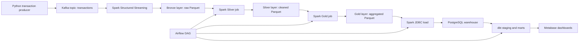

# FinTech Data Platform - Architecture

This document explains the architecture of the FinTech Data Platform from a Data Engineering perspective.

The project simulates a realistic local analytical platform for fintech transaction events. It is intentionally built as a compact production-style system: clear layers, separated responsibilities, repeatable Docker Compose runtime, data quality checks, orchestration, and BI consumption.

---

## 1. Architecture Goal

The goal is to transform raw transaction events into business-ready analytical datasets.

The platform demonstrates:

- event-driven ingestion,
- Spark-based processing,
- Bronze/Silver/Gold data lake design,
- warehouse loading,
- dbt-based analytics modeling,
- automated data quality checks,
- Airflow orchestration,
- Metabase reporting.

The project avoids unnecessary complexity such as Kubernetes, microservices, and machine learning because they would not improve the main portfolio signal for a Junior+/Mid Data Engineer role.

---

## 2. High-Level Architecture



### Main data flow

1. Python producer generates synthetic fintech transactions.
2. Kafka receives transaction events in the `transactions` topic.
3. Spark Structured Streaming writes raw Kafka messages to Bronze Parquet.
4. Spark Silver job parses JSON, casts types, validates records, and writes clean transactions.
5. Spark Gold job creates business aggregates.
6. Spark loads Gold datasets into PostgreSQL through JDBC.
7. dbt builds staging views and analytical marts.
8. Metabase reads dbt marts from PostgreSQL.
9. Airflow orchestrates the analytical workflow.

---

## 3. Components and Responsibilities

| Component | Responsibility |
| --- | --- |
| Python producer | Generate realistic synthetic transaction events |
| Kafka | Transport and buffer transaction events |
| Spark | Ingest, clean, validate, aggregate, and load data |
| Parquet data lake | Store Bronze, Silver, and Gold layers |
| PostgreSQL | Serve warehouse tables for dbt and BI |
| dbt | Build SQL models, tests, and documentation |
| Airflow | Orchestrate execution order |
| Metabase | Provide dashboard and business exploration layer |
| Docker Compose | Run the full stack locally |

This separation is deliberate. Each tool has one clear role, which makes the system easier to explain, debug, and extend.

The local PostgreSQL server contains separate databases for separate responsibilities:

```text
fintech  -> warehouse tables and dbt analytical models
airflow  -> Airflow metadata such as DAG runs, task states, logs, variables, and connections
metabase -> Metabase metadata such as dashboards, questions, users, and settings
```

This keeps operational metadata separate from analytical warehouse data.

---

## 4. Data Model

The generated transaction event contains fields such as:

```json
{
  "transaction_id": "uuid",
  "customer_id": 1234,
  "merchant": "Allegro",
  "amount": 249.99,
  "currency": "PLN",
  "country": "PL",
  "payment_method": "CARD",
  "fraud_flag": false,
  "event_timestamp": "2026-07-28T10:15:00+00:00"
}
```

The producer intentionally includes merchant weights, amount ranges, payment methods, and fraud probabilities to make the data more realistic than random uniform test data.

---

## 5. Data Lake Layers

### Bronze Layer

Bronze stores raw Kafka events with minimal transformation.

Current stored fields include:

- raw JSON payload,
- Kafka topic,
- Kafka partition,
- Kafka offset,
- Kafka timestamp,
- Bronze ingestion timestamp.

Purpose:

- preserve raw source data,
- support debugging,
- allow reprocessing if downstream logic changes.

### Silver Layer

Silver stores clean, typed transaction records.

Main processing steps:

- parse raw JSON using an explicit Spark schema,
- flatten the transaction structure,
- convert timestamps,
- validate required fields,
- write invalid records to a rejected-records dataset with rejection reasons,
- add ingestion metadata,
- add pipeline version metadata.

Silver is the standardized record-level dataset used by downstream aggregation logic.

### Gold Layer

Gold stores business-ready aggregates.

Current datasets:

- `daily_transaction_metrics`
- `merchant_metrics`

These datasets are smaller, easier to query, and closer to business reporting needs than raw transaction records.

---

## 6. Warehouse and dbt Layer

Spark loads Gold Parquet datasets into PostgreSQL.

Base warehouse tables:

- `daily_transaction_metrics`
- `merchant_metrics`

These tables are loaded with a full refresh strategy. Each pipeline run truncates and reloads the warehouse tables from the current Gold Parquet datasets while preserving dbt dependencies.

Both tables include `warehouse_loaded_at`, which records when the current load reached PostgreSQL. This improves operational auditability without adding incremental-load complexity.

dbt uses these tables as sources and builds:

- staging models,
- analytical marts,
- tests,
- documentation.

Current mart models:

- `mart_daily_kpis`
- `mart_merchant_performance`
- `mart_merchant_tier`
- `mart_platform_summary`
- `mart_top_merchants`

This split is important: Spark handles data engineering transformations at the lake level, while dbt handles warehouse analytics modeling in SQL.

---

## 7. Orchestration

Airflow is used for orchestration only. Business logic stays in Spark and dbt.

Current DAG:

```text
daily_fintech_pipeline

ingest_bronze_layer_for_demo -> build_silver_layer -> build_gold_layer -> load_gold_to_postgres -> dbt_run -> dbt_test
```

Current behavior:

1. Run finite Spark Structured Streaming job that ingests currently available Kafka messages into Bronze Parquet.
2. Run Spark job that builds the Silver layer from Bronze data.
3. Run Spark job that builds the Gold layer from Silver data.
4. Run Spark job that loads Gold data into PostgreSQL.
5. Run dbt models.
6. Run dbt tests.

The Bronze ingestion task uses `availableNow=True`, so it can be orchestrated by Airflow and finish successfully during a local demo.

The repository also contains `spark/app/bronze_stream.py`, which represents the long-running streaming variant. In a production setup, this type of job would usually be managed separately from the analytical Airflow DAG.

The demo ingestion job and the long-running stream use separate checkpoint directories to avoid mixing execution state between local Airflow runs and manual streaming experiments. They should not be run at the same time because both write to the same Bronze output path.

---

## 8. Data Quality Strategy

Data quality is handled in two places.

### Spark Silver validation

Spark filters records with:

- missing transaction ID,
- missing customer ID,
- missing merchant,
- non-positive amount,
- missing currency,
- missing country,
- missing payment method,
- missing fraud flag,
- invalid event timestamp.

Rejected records are written to:

```text
/opt/spark-data/silver/rejected_transactions
```

Each rejected record includes the raw event, Kafka timestamp, rejection reason, rejection timestamp, and pipeline version.

### dbt tests

dbt validates assumptions in the warehouse and mart layer, including:

- not-null checks,
- uniqueness checks,
- accepted values,
- relationships where applicable.

This layered validation is realistic: Spark protects the record-level pipeline, while dbt protects analytical outputs.

---

## 9. Reporting Layer

Metabase connects to PostgreSQL and visualizes dbt mart tables.

Dashboard areas:

- platform KPIs,
- revenue trend,
- transaction trend,
- top merchants,
- merchant performance,
- merchant tier distribution,
- fraud-related metrics.

This layer shows that the platform produces business-consumable outputs, not only technical files.

---

## 10. Production-Like Design Choices

### Docker Compose instead of Kubernetes

Docker Compose keeps the project easy to run locally. Kubernetes would add operational complexity without improving the core Data Engineering portfolio signal.

### PostgreSQL instead of Snowflake or BigQuery

PostgreSQL is sufficient for a local warehouse simulation. In a production cloud platform, this layer could be replaced by Snowflake, BigQuery, Redshift, or Synapse without changing the core architecture.

### Parquet instead of a database-only design

Parquet introduces a real data lake layer. This makes the project stronger than a simple Kafka-to-database pipeline.

### dbt on top of PostgreSQL

dbt demonstrates analytics engineering practices: modular SQL, tests, documentation, and mart modeling.

### Airflow as orchestration, not transformation

Airflow coordinates tasks. It does not contain transformation logic. This keeps responsibilities clean.

---

## 11. Current Limitations

This is a local portfolio project, so some production concerns are simplified:

- synthetic data instead of real source systems,
- local Docker runtime instead of cloud infrastructure,
- simple credentials in local configuration,
- no centralized secret manager,
- no schema registry,
- no monitoring and alerting stack,
- no CI/CD pipeline yet,
- no incremental loading strategy yet.

These are acceptable trade-offs for the current project stage because the goal is a clear, runnable, interview-ready data platform.

---

## 12. Recommended Next Improvements

Highest-value improvements:

1. Add screenshots of Airflow, Kafka UI, dbt docs, and Metabase to `docs/`.
2. Add CI checks for dbt tests or SQL linting.

Lower-priority improvements:

- cloud deployment,
- Snowflake or BigQuery integration,
- Great Expectations,
- data lineage tooling,
- Kubernetes.

The project should prioritize clarity, reproducibility, and interview value before adding more infrastructure.

---

## 13. Interview Summary

A concise way to explain the project:

> I built a local end-to-end fintech data platform. A Python producer generates transaction events into Kafka. Spark processes the events through Bronze, Silver, and Gold Parquet layers. Gold metrics are loaded into PostgreSQL, dbt builds analytical marts and tests, Airflow orchestrates the workflow, and Metabase exposes the final business dashboards.

The main engineering value is not any single tool. The value is the complete flow, clear layer separation, data quality strategy, and realistic production-style structure.
