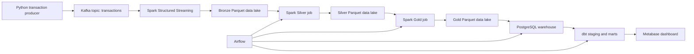

# FinTech Data Platform

End-to-end data engineering portfolio project that simulates a fintech transaction analytics platform.

The project ingests synthetic transaction events, processes them through a layered data lake, loads business metrics into PostgreSQL, transforms them with dbt, orchestrates the analytical workflow with Airflow, and exposes the data to Metabase for reporting.

The goal is to show a realistic local data platform, not a course-style single-script demo.

---

## Business Problem

Fintech companies process large volumes of payment transactions. Business teams need reliable access to metrics such as:

- daily revenue,
- transaction volume,
- average transaction value,
- merchant performance,
- fraud indicators,
- platform-level KPIs.

Raw event data is not suitable for direct reporting. This project transforms raw transaction events into clean, business-ready analytical tables.

---

## Architecture



### Data flow

1. `producer/producer.py` generates synthetic fintech transactions.
2. Kafka stores events in the `transactions` topic.
3. Spark reads Kafka events and stores raw JSON in the Bronze layer.
4. Spark parses, validates, and standardizes data into the Silver layer.
5. Spark creates Gold business aggregates.
6. Gold datasets are loaded into PostgreSQL through JDBC.
7. dbt builds staging models and analytical marts.
8. Metabase connects to PostgreSQL for dashboarding.
9. Airflow orchestrates the analytical part of the pipeline.

---

## Technology Stack

| Area | Technology | Purpose |
| --- | --- | --- |
| Event generation | Python | Synthetic fintech transaction producer |
| Streaming | Apache Kafka | Event transport and decoupling |
| Processing | Apache Spark | Streaming ingestion, validation, aggregation |
| Data lake | Parquet | Bronze, Silver, Gold storage |
| Warehouse | PostgreSQL | Serving layer for analytics |
| Transformations | dbt | SQL models, tests, documentation |
| Orchestration | Apache Airflow | Pipeline execution and dependency management |
| BI | Metabase | Dashboard and data exploration |
| Runtime | Docker Compose | Local reproducible environment |

---

## Repository Structure

```text
.
+-- airflow/
|   +-- dags/
|   +-- Dockerfile
|   +-- entrypoint.sh
|   +-- wait-for-postgres.sh
+-- dbt/
|   +-- models/
|   |   +-- staging/
|   |   +-- marts/
|   +-- dbt_project.yml
|   +-- profiles.yml
+-- producer/
|   +-- Dockerfile
|   +-- producer.py
|   +-- requirements.txt
+-- spark/
|   +-- app/
|   |   +-- bronze_stream.py
|   |   +-- silver_job.py
|   |   +-- gold_job.py
|   |   +-- load_gold_to_postgres.py
|   |   +-- schemas.py
|   +-- conf/
|   +-- Dockerfile
+-- postgres/
|   +-- initdb/
+-- docker-compose.yml
+-- README.md
+-- ARCHITECTURE.md
```

---

## Documentation

- [Technical architecture](ARCHITECTURE.md)
- [Interview guide](INTERVIEW_GUIDE.md)

---

## Quick Start

### 1. Requirements

Install:

- Docker Desktop,
- Docker Compose,
- Git.

### 2. Create local environment file

Copy the example environment file:

```bash
cp .env.example .env
```

On Windows PowerShell:

```powershell
Copy-Item .env.example .env
```

The file contains:

```env
KAFKA_BOOTSTRAP_SERVERS=kafka:9092
KAFKA_TOPIC=transactions
```

### 3. Start the platform

```bash
docker compose up --build -d
```

### 4. Check running services

```bash
docker compose ps
```

Expected core services:

- `postgres`
- `kafka`
- `kafka-ui`
- `producer`
- `spark`
- `dbt`
- `airflow`
- `metabase`

---

## Local URLs

| Service | URL |
| --- | --- |
| Kafka UI | http://localhost:8080 |
| dbt docs server | http://localhost:8081 after running `dbt docs serve` |
| Airflow UI | http://localhost:8088 |
| Metabase | http://localhost:3000 |
| PostgreSQL | localhost:5432 |

PostgreSQL local credentials:

```text
user: fintech
password: fintech
database: fintech
```

---

## Useful Commands

### Start containers

```bash
docker compose up --build -d
```

### Stop containers

```bash
docker compose down
```

### View logs

```bash
docker compose logs -f producer
docker compose logs -f spark
docker compose logs -f airflow
```

### Run dbt models

```bash
docker exec dbt dbt run
```

### Run dbt tests

```bash
docker exec dbt dbt test
```

### Generate dbt docs

```bash
docker exec dbt dbt docs generate
```

### Serve dbt docs

```bash
docker exec dbt dbt docs serve --host 0.0.0.0 --port 8081
```

---

## Verify a Successful Pipeline Run

After triggering `daily_fintech_pipeline` in Airflow, all tasks should finish with `success`:

```text
build_silver_layer -> build_gold_layer -> load_gold_to_postgres -> dbt_run -> dbt_test
```

Check when warehouse tables were last loaded:

```powershell
docker exec postgres psql -U fintech -d fintech -c "select max(warehouse_loaded_at) from daily_transaction_metrics;"
```

```powershell
docker exec postgres psql -U fintech -d fintech -c "select max(warehouse_loaded_at) from merchant_metrics;"
```

Check row counts:

```powershell
docker exec postgres psql -U fintech -d fintech -c "select count(*) from daily_transaction_metrics;"
```

```powershell
docker exec postgres psql -U fintech -d fintech -c "select count(*) from merchant_metrics;"
```

Check a dbt mart:

```powershell
docker exec postgres psql -U fintech -d fintech -c "select * from mart_platform_summary;"
```

Note: PostgreSQL timestamps may be shown in UTC. For example, `19:24 UTC` equals `21:24` in Poland during summer time.

---

## Test Rejected Records

The normal producer generates valid transactions. To test Silver-layer rejection logic, send five intentionally invalid events:

If the stack was already running before this script was added, rebuild the producer image first:

```powershell
docker compose up -d --build producer
```

```powershell
docker exec producer python send_invalid_transactions.py
```

Run the Bronze streaming job for 30-60 seconds so the invalid Kafka events are written to Bronze:

```powershell
docker exec spark /opt/spark/bin/spark-submit /opt/spark-apps/app/bronze_stream.py
```

Stop it with `Ctrl + C`, then trigger `daily_fintech_pipeline` in Airflow.

After the DAG finishes, inspect rejected records:

```powershell
docker exec -it spark /opt/spark/bin/pyspark
```

Inside PySpark:

```python
df = spark.read.parquet("/opt/spark-data/silver/rejected_transactions")
df.groupBy("rejection_reason").count().show(truncate=False)
df.select("rejection_reason", "raw_event_json").show(20, truncate=False)
```

Expected rejection reasons include:

- `missing_transaction_id`
- `non_positive_amount`
- `missing_merchant`
- `invalid_event_timestamp`
- `missing_customer_id`
- `missing_amount`
- `missing_currency`
- `missing_payment_method`
- `missing_fraud_flag`

Expected grouped result:

```text
+-------------------------------------------------------------------------------------------------+-----+
|rejection_reason                                                                                 |count|
+-------------------------------------------------------------------------------------------------+-----+
|missing_transaction_id                                                                           |1    |
|non_positive_amount                                                                              |1    |
|missing_merchant                                                                                 |1    |
|invalid_event_timestamp                                                                          |1    |
|missing_customer_id, missing_amount, missing_currency, missing_payment_method, missing_fraud_flag|1    |
+-------------------------------------------------------------------------------------------------+-----+
```

---

## Data Lake Layers

### Bronze

Stores raw Kafka events as JSON strings with Kafka metadata.

Purpose:

- preserve raw input,
- support auditability,
- allow reprocessing.

### Silver

Stores parsed and validated transaction records.

Main transformations:

- JSON parsing,
- type casting,
- timestamp normalization,
- required field validation,
- positive amount validation,
- rejected-record capture with rejection reasons,
- ingestion metadata.

Rejected records are written separately to:

```text
/opt/spark-data/silver/rejected_transactions
```

This keeps invalid records auditable without allowing them into analytical datasets.

### Gold

Stores business-ready aggregates.

Current Gold datasets:

- `daily_transaction_metrics`
- `merchant_metrics`

---

## Warehouse and dbt Models

Spark loads Gold datasets into PostgreSQL.

Base warehouse tables:

- `daily_transaction_metrics`
- `merchant_metrics`

Both warehouse tables include `warehouse_loaded_at`, a technical timestamp showing when the current Gold dataset was loaded into PostgreSQL.

The current loading strategy is full refresh: each DAG run truncates and reloads the warehouse tables from the current Gold Parquet datasets. This keeps the portfolio pipeline simple, reproducible, and easy to debug while preserving dbt dependencies.

dbt then builds analytical models:

- `mart_daily_kpis`
- `mart_merchant_performance`
- `mart_merchant_tier`
- `mart_platform_summary`
- `mart_top_merchants`

dbt tests validate model assumptions such as not-null fields, accepted values, uniqueness, and relationships.

---

## Airflow DAG

The project contains an Airflow DAG:

```text
daily_fintech_pipeline
```

Current DAG sequence:

```text
build Silver layer -> build Gold layer -> load Gold data to PostgreSQL -> dbt run -> dbt test
```

This demonstrates orchestration of the analytical workflow while keeping transformation logic inside Spark and dbt.

---

## Analytical Outputs

The platform supports reporting for:

- daily transaction KPIs,
- total revenue,
- average transaction amount,
- fraud rate,
- merchant revenue,
- merchant transaction volume,
- top merchants,
- merchant tier classification,
- platform-level summary metrics.

These outputs are consumed by Metabase dashboards.

---

## Key Engineering Decisions

### Why Kafka?

Kafka simulates event-driven ingestion. It decouples the transaction producer from downstream processing and reflects how real transactional systems often publish events.

### Why Spark?

Spark demonstrates distributed processing concepts and supports both streaming ingestion and batch-style transformations over data lake files.

### Why Parquet?

Parquet is a columnar storage format commonly used in data lakes. It is efficient for analytical workloads and works well with Spark.

### Why PostgreSQL?

PostgreSQL acts as a lightweight local serving warehouse. It keeps the project easy to run while still supporting realistic SQL analytics and BI integration.

### Why dbt?

dbt separates analytical SQL transformations from processing code. It adds tests, documentation, and a clear modeling layer.

### Why Airflow?

Airflow shows workflow orchestration, dependency management, and repeatable execution of the analytical pipeline.

### Why no Kubernetes or microservices?

The project is designed for a portfolio and local reproducibility. Docker Compose is enough to demonstrate the data platform architecture without unnecessary operational complexity.

---

## What This Project Demonstrates

- Building an end-to-end data platform.
- Working with streaming and batch processing patterns.
- Designing Bronze, Silver, and Gold data lake layers.
- Loading analytical datasets into a warehouse.
- Creating dbt staging and mart models.
- Applying data quality checks.
- Orchestrating a data workflow with Airflow.
- Exposing analytics through a BI tool.
- Keeping a complex stack reproducible with Docker Compose.

---

## Future Improvements

High-value improvements for portfolio quality:

- add a small demo script for recruiters,
- add screenshots of Metabase and Airflow to `docs/`,
- add CI checks for dbt tests and SQL linting.

Lower-priority improvements:

- cloud deployment,
- Snowflake or BigQuery warehouse,
- Great Expectations,
- monitoring stack,
- Kubernetes.

These are intentionally not part of the current version to avoid overengineering.
